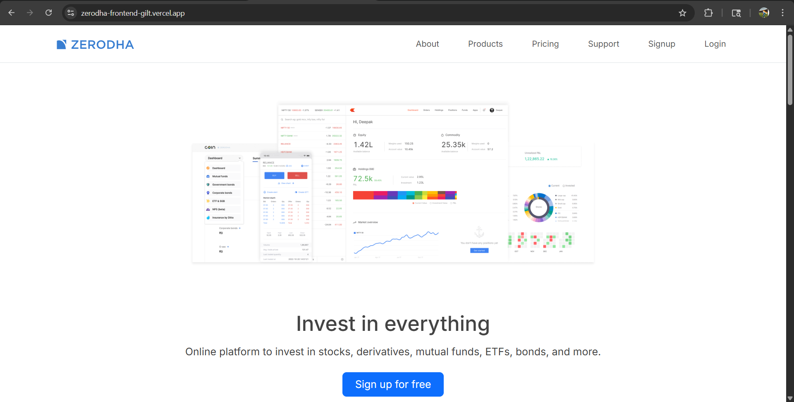
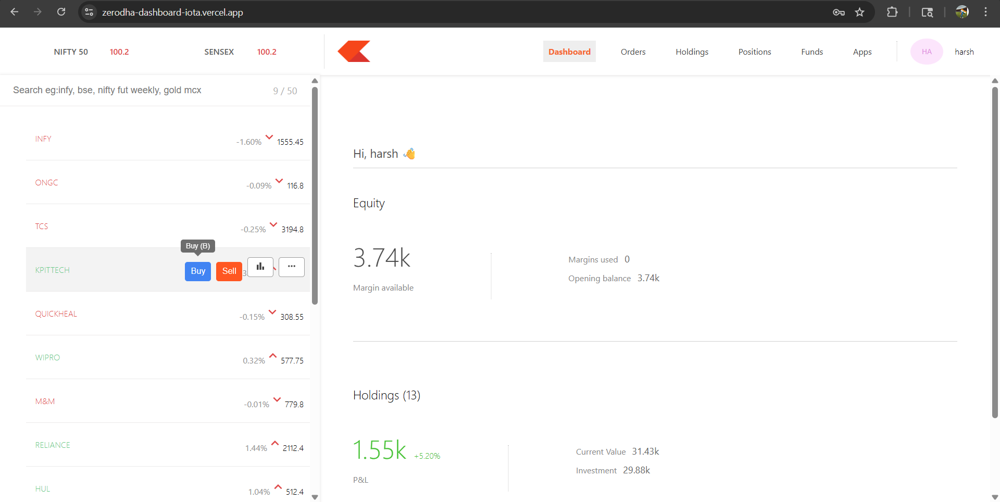
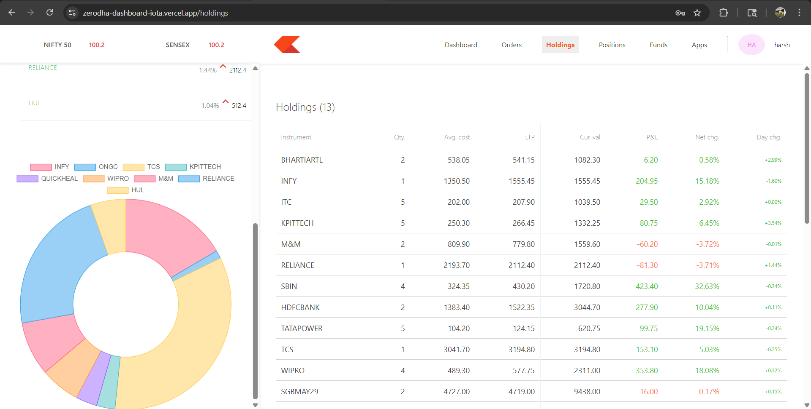
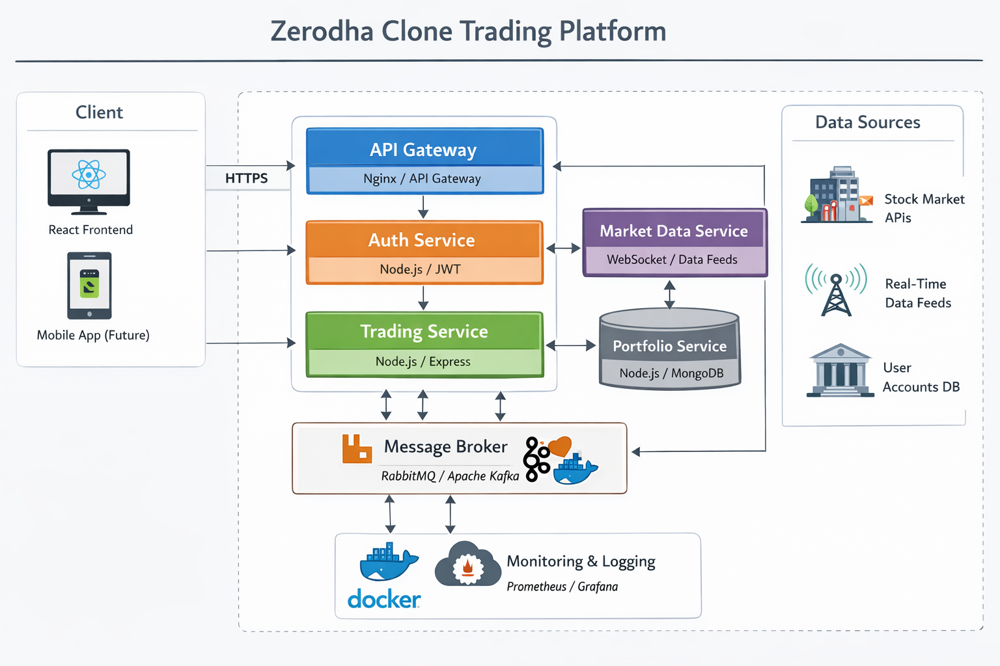

# 🚀 Zerodha Clone – Real-Time Full Stack Trading Platform

> 💹 A scalable, production-ready stock trading platform inspired by Zerodha Kite, built using MERN, Redis, Socket.IO, Docker, and microservices-based architecture.

---


# 🌐 Live Demo

🚀 Frontend  
https://zerodha-frontend-gilt.vercel.app/

⚙️ Backend API  
https://docker-setup-backend-latest.onrender.com

📊 Dashboard  
https://zerodha-dashboard-iota.vercel.app/

---

# 📸 Screenshots

## 🔐 Home Page


## 📊 Trading Dashboard


## 💼 Holdings & Portfolio


---

# 🏗️ System Architecture



## 🔄 Service Communication

- Frontend communicates with backend using REST APIs
- Backend handles authentication, trading engine, holdings, and positions
- Redis is used for caching and optimized API performance
- Socket.IO powers real-time trading updates
- Docker Compose orchestrates local multi-service development
- Independent services deployed separately for scalability

---

# ⚡ Real-Time System Design

- 📈 Live stock price broadcasting using Socket.IO
- 🔄 Real-time holdings and position synchronization
- ⚡ Instant order execution updates
- 🧠 Room-based websocket communication
- 🚀 Low-latency event-driven architecture

---

# 📦 Microservices Structure

| Service | Description | Repository |
|---|---|---|
| 🔙 Backend | Authentication, Trading Engine & APIs | https://github.com/Harshjadhav003/zerodha-backend |
| 🎨 Frontend | React-based Trading UI | https://github.com/Harshjadhav003/zerodha-frontend |
| 📊 Dashboard | Analytics & Visualization | https://github.com/Harshjadhav003/zerodha-dashboard |
| 🐳 Docker Setup | Multi-container Deployment | https://github.com/Harshjadhav003/zerodha-docker |

---

# 🛠️ Tech Stack

## 💻 Frontend

- React.js
- Axios
- Chart.js / Recharts
- Socket.IO Client

## ⚙️ Backend

- Node.js
- Express.js
- JWT Authentication
- Socket.IO

## 🗄️ Database & Cache

- MongoDB
- Redis

## 🚀 DevOps & Deployment

- Docker
- Docker Compose
- Git Submodules
- Vercel
- Render

---

# 🔥 Key Features

- 🔐 Secure JWT-based Authentication
- 📊 Real-time Trading Dashboard
- 💼 Portfolio & Holdings Management
- 💹 Buy/Sell Stock Simulation Engine
- ⚡ Real-time Stock Price Feed
- 📈 Interactive Financial Charts
- 🚀 Redis-based API Caching
- 🔄 WebSocket-driven Live Updates
- 🧠 Event-driven Backend Architecture
- 🐳 Dockerized Multi-Service Deployment
- ⚙️ Scalable Modular Backend Design

---

# 📊 Engineering Highlights

- ⚡ Handles live stock price updates every second
- 🚀 Optimized API responses using Redis caching
- 🔄 Event-driven real-time synchronization
- 🧠 Designed using scalable modular architecture
- 📦 Multi-repository project management using Git Submodules

---

# ⚡ Getting Started

## 1️⃣ Clone Repository

```bash
git clone --recurse-submodules https://github.com/Harshjadhav003/ZERODHA.git

cd ZERODHA
````

---

## 2️⃣ Run with Docker (Recommended 🚀)

Make sure Docker is installed and running.

```bash
docker-compose up --build
```

Application URLs:

* Frontend → http://localhost:5173
* Backend → http://localhost:3002

---

## 3️⃣ Manual Setup

### 🔙 Backend Setup

```bash
cd backend

npm install

npm run dev
```

### 🎨 Frontend Setup

```bash
cd frontend

npm install

npm run dev
```

---

# 📂 Project Structure

```bash
ZERODHA/
│
├── frontend/          # React frontend
├── backend/           # Node.js backend
├── dashboard/         # Analytics dashboard
├── docker/            # Docker configuration
├── screenshots/       # Project screenshots
│
└── README.md
```

---

# 🧠 What I Learned

* Designing scalable backend systems
* Building real-time applications using Socket.IO
* Implementing Redis caching strategies
* Managing distributed services using Docker
* Building secure JWT authentication systems
* Designing event-driven architectures
* Deploying production-ready MERN applications

---

# 🚀 Future Enhancements

* 💳 Payment Gateway Integration
* 📱 Fully Responsive Mobile UI
* 🔔 Push Notifications
* 🧠 AI-based Stock Recommendation Engine
* 📈 Advanced Trading Analytics
* ☁️ Kubernetes-based Deployment
* 📊 Real Market API Integration

---

# 👨‍💻 Author

## Harsh Jadhav

🔗 LinkedIn
https://www.linkedin.com/in/harsh-jadhav-dev

🔗 GitHub
https://github.com/Harshjadhav003

---

# ⭐ Support

If you found this project useful, consider giving it a ⭐ on GitHub.

---

# 📌 Disclaimer

This project is built for educational and demonstration purposes only.

No real trading or financial transactions are performed.

```
```
